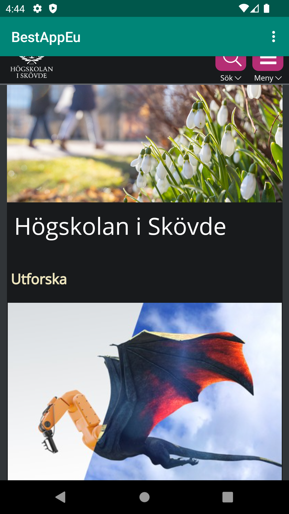

# Rapport

Namnet ändrades i strings.xml
Kodsnutt:
```
 <string name="app_name">BestAppEu</string>
 ```

Åtkomst till internet tilläts i AndroidManifest.xml.
Kodsnutt:
```
<manifest xmlns:android="http://schemas.android.com/apk/res/android"
    package="com.example.webviewapp">
    <uses-permission android:name="android.permission.INTERNET"/>
 ```

Webview element skapades med ID: @+id/my_webview i activity_main.xml
Kodsnutt:
```
<WebView
        android:id="@+id/my_webview"
        android:layout_width="match_parent"
        android:layout_height="match_parent"
        />
  ```

Skapade privat medlem kallad myWebview i "onCreate()" i MainActivity.java
Kodsnutt:
```
private WebView myWebView;
```

Lokaliserade WebView elementet genom att använda Webview ID i MainActivity.java
Kodsnutt:
```
myWebView = findViewById(R.id.my_webview);
```

Skapade en ny WebView client att sätta ihop med vår WebView i MainActivity.java
Kodsnutt:
```
myWebView.setWebViewClient(new WebViewClient());
```

Tillät WebViewClient att använda javascript i MainActivity.java och la till en html-fil i assets mappen.
Kodsnutt:
```
myWebView.getSettings().setJavaScriptEnabled(true);
```

Sedan implementerades funktionerna för external och internal WebPage tillsammans med respektive adresser i MainActivity.java
```
public void showExternalWebPage(){
        myWebView.loadUrl("https://his.se");
    }

    public void showInternalWebPage(){
        myWebView.loadUrl("file:///android_asset/minfil.html");

    }
    private WebView myWebView;
```

Slutligen för att få dessa funktioner att fungera med klick på dropdown-menyn läggs 
funktionerna inom if-satser i funktionen onOptionsItemSelected() i MainActivity.java.
```
public boolean onOptionsItemSelected(MenuItem item) {
        // Handle action bar item clicks here. The action bar will
        // automatically handle clicks on the Home/Up button, so long
        // as you specify a parent activity in AndroidManifest.xml.
        int id = item.getItemId();

        //noinspection SimplifiableIfStatement
        if (id == R.id.action_external_web) {
            Log.d("==>","Will display external web page");
            showExternalWebPage();
            return true;
        }

        if (id == R.id.action_internal_web) {
            Log.d("==>","Will display internal web page");
            showInternalWebPage();
            return true;
        }

        return super.onOptionsItemSelected(item);
    }
```




